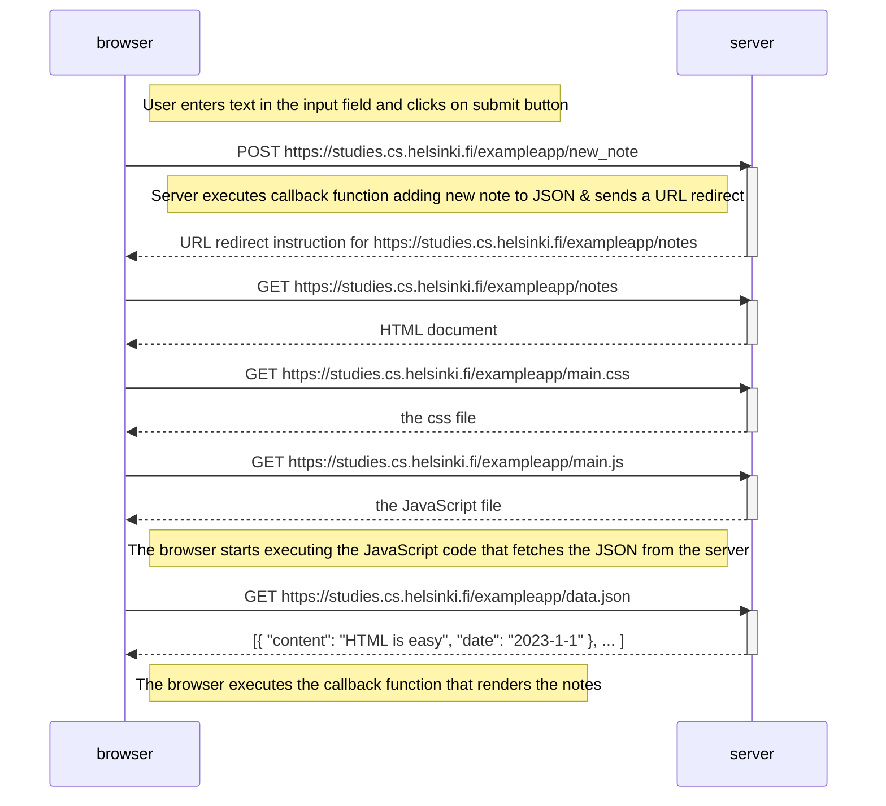
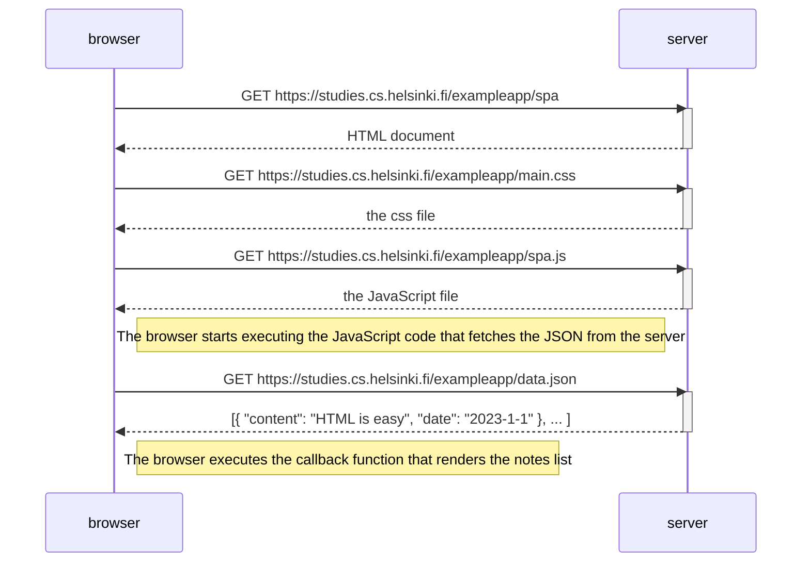
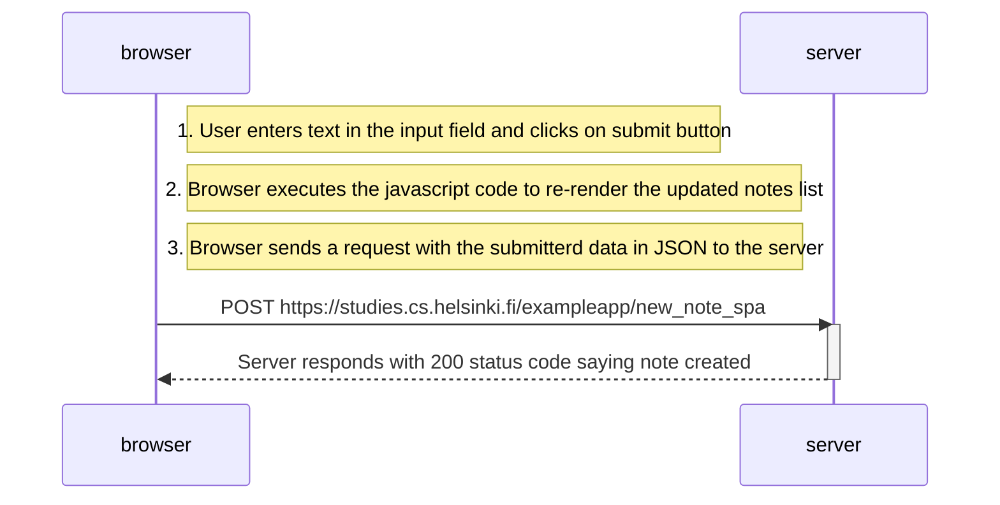

### Exercise solution (0.4 to 0.6) for part 0, Fundamentals of Web apps

1. **Exercise: 0.4**

   Create a sequence diagram depicting the situation where the user creates a new note on the page https://studies.cs.helsinki.fi/exampleapp/notes by writing something into the text field and clicking the submit button.

   **Solution:**

2. **Exercise 0.5**

   Create a diagram depicting the situation where the user goes to the single-page app version of the notes app at https://studies.cs.helsinki.fi/exampleapp/spa.

   **Solution:**

3. **Exercise 0.6**

   Create a diagram depicting the situation where the user creates a new note using the single-page version of the app.

   **Solution:**

